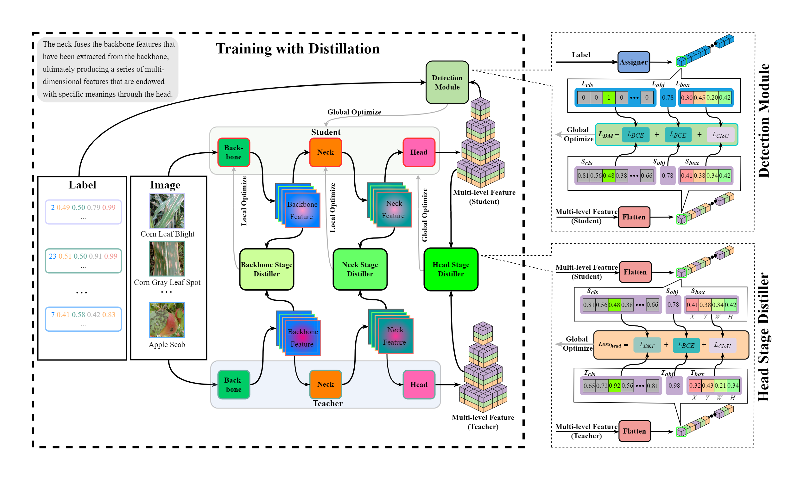

# Mutil-stageKnowledgeDistillation

**Mutil-stage knowledge distillation (MSKD)** can facilitate the accuracy of plant disease detection, which may be a new and vital direction for lightweight algorithmic models in smart agriculture with practical applications.

## The Overview of Mutil-stage Knowledge Distillation




## About Data Cleaning
We cleaned the labels of the PlantDoc dataset, and we will provide the cleaned labels. 
However, it should be noted that the names of a very small number of pictures are too long and have been modified by us.


## Distill Model

```shell
python distill.py --data xxx --hyp xxx --epochs xx --batch-size xx --img-size xx --device xxx --name xxx --teacher_weights xx.pt --teacher_cfg xx.cfg --student_cfg xx.cfg --student_backbone_feature xx,xx,xx,xx --teacher_backbone_feature xx,xx,xx,xx --student_neck_feature xx,xx,xx,xx --teacher_neck_feature xx,xx,xx,xx --head_weight xx --neck_weight xx --backbone_weight xx --target_weight xx --background_weight xx --attention_weight xx --global_weight xx --distillation_weight xx --new_head_dist ----backbone_distillation neck_distillation --origin_loss
```

**tips:**  
> "--new_head_dist ----backbone_distillation neck_distillation --origin_loss"
 stands for starting head stage distiller, backbone stage distiller, neck stage distiller and  detection mudule.  


## Distilled layer

### The teacher modle
The 2 sets of layers we selected from **the teacher model (YOLOR)** are used in the backbone stage distiller and neck stage distiller, and they are:
`(43,70,85,115)` , `(163,176,189,202)` . 

### The student model

The 2 sets of layers we selected from the student model are used in the backbone stage distiller and neck stage distiller, too. 

- **YOLOR-Light-v1** `(13,19,25,37)` , `(67,74,81,88)`
- **YOLOR-Light-v2** `(25,39,49,63)` , `(99,108,117,126)` 
- **Mobile-YOLOR-v1** `(5,8,12,17)` , `(53,62,71,80)`
- **Mobile-YOLOR-v2** `(5,8,12,17)` , `(53,62,71,80)`


## Result


